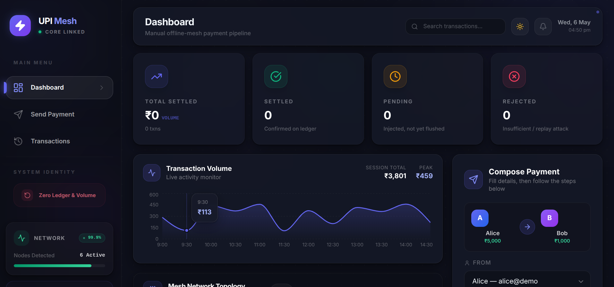
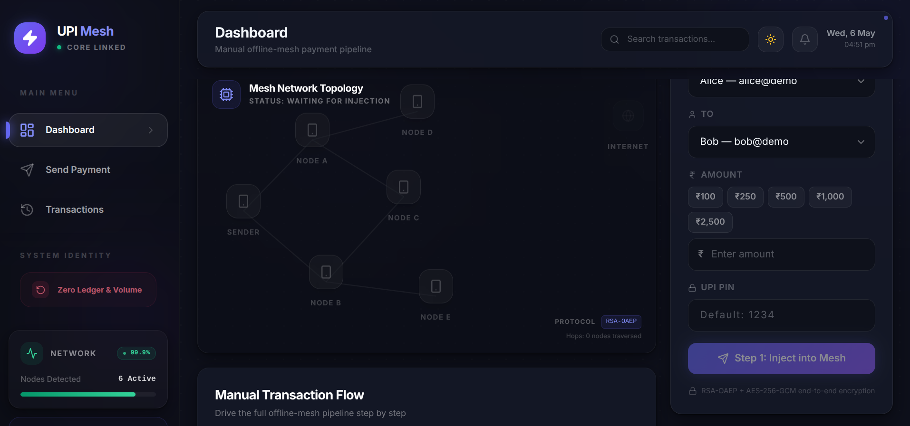
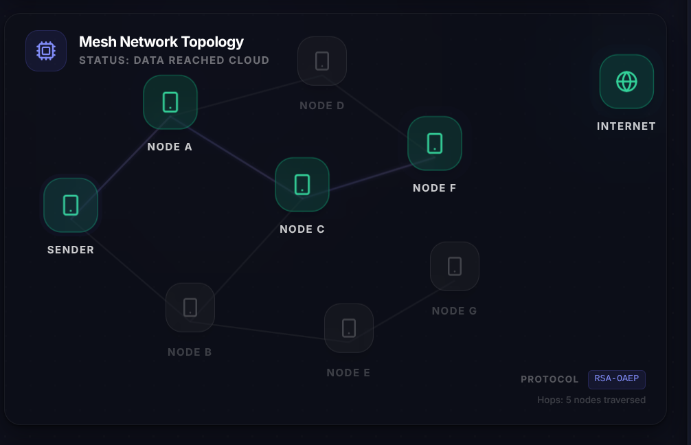
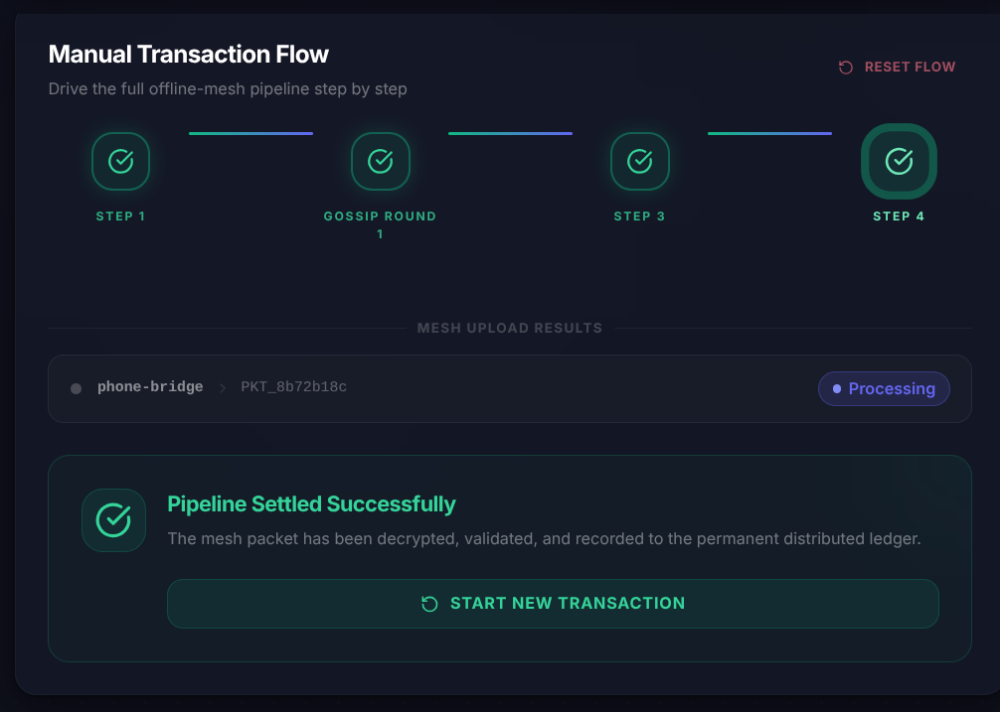
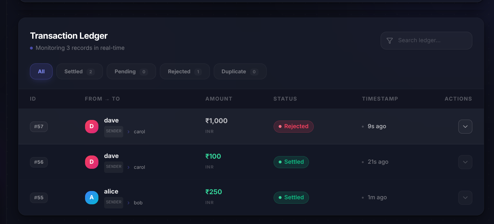

<div align="center">
  <h1>🚀 UPI Offline Mesh</h1>
  <h3>Production-Grade Distributed Payment Routing System</h3>

[](https://openjdk.org/projects/jdk/17/)
[](https://spring.io/projects/spring-boot)
[](https://reactjs.org/)
[](https://kafka.apache.org/)
[](https://redis.io/)
[](https://www.postgresql.org/)
[](https://www.docker.com/)

</div>

---

> **⚠️ CONCEPTUAL NOTE: DEFERRED, NOT REAL-TIME**
> This system is designed for **Deferred Settlement**, not real-time clearing. When you send money in the offline mesh, it acts as a cryptographically secure IOU. The actual bank-level settlement only occurs once the encrypted packet physically reaches an internet-connected zone and is processed by this backend.

**UPI Offline Mesh** is a full-stack, distributed backend system that enables digital UPI payments without active internet connectivity. It simulates a **Bluetooth-style mesh network** to route encrypted transactions peer-to-peer until a node connects to the internet.

**The V2 Architecture** upgrades the system to a true production-grade distributed architecture utilizing **Kafka** for resilient message queuing, **Redis** for distributed atomic locks (idempotency), **PostgreSQL** for permanent ledger storage, and a **React/Vite** frontend for real-time mesh visualization.

---

## 📸 Screenshots & Visuals

<div align="center">

### Main Dashboard

<br/><br/>

### Transaction Analytics

<br/><br/>

### Mesh Network Topology

<br/><br/>

### Manual Transaction Flow

<br/><br/>

### Real-Time Transaction Ledger

<br/><br/>

</div>

## 🧠 The "Offline Payment" Problem

Traditional digital payments (like UPI) operate on a synchronous, strictly-connected model. Both the sender and the bank core must establish a secure connection in real-time to authorize a deduction. 

**The Challenge:** What happens in environments with zero cellular coverage? (e.g., dense basements, flights, remote rural areas, or during network outages).

**The Solution:** **Deferred Settlement via Mesh Routing**. 
Nearby mobile devices act as an untrusted peer-to-peer router network. Payments travel physically (via people walking) until they hit an internet bridge. The transaction is fully encrypted end-to-end, so intermediate phones act as blind carrier pigeons.

---

## 🏗️ Technical Architecture & Engineering Deep Dive

The system operates across a robust, multi-container microservice infrastructure to handle extreme concurrency, async processing, and race conditions.

### 1. The Distributed Ingestion Pipeline (Apache Kafka)
In a mesh network, when a "bridge node" walks out of a basement and hits a 4G tower, it will instantly upload hundreds or thousands of cached packets.
- **The Problem:** Processing RSA decryption and database transactions synchronously would immediately exhaust Tomcat HTTP threads and crash the backend.
- **The Solution:** The Spring Boot `/api/bridge/ingest` REST controller acts purely as a Kafka Producer. It takes the incoming payload, fires it into a Kafka topic (`mesh-transactions-topic`), and instantly returns a `202 Accepted` to the mobile device. 
- **Scale:** Dedicated Kafka Consumer groups then drain the queue at their own pace, ensuring the system remains highly available regardless of traffic spikes.

### 2. The Atomic Idempotency Engine (Redis `SETNX`)
Because packets are gossiped endlessly across the mesh, 10 different people might upload the *exact same payment packet* simultaneously. We must guarantee the sender is only debited once.
- The Kafka consumer computes a `SHA-256` hash of the authenticated ciphertext.
- It executes a Redis atomic lock: `SET packet_hash "CLAIMED" NX EX 86400` (Set if Not Exists, Expire in 24 hours).
- **The Magic:** Redis operates on a single thread. Even if 50 Kafka consumer threads try to acquire this lock at the exact same nanosecond, Redis guarantees exactly *one* will succeed. The others receive a failure and gracefully drop the duplicate packet.

### 3. Zero-Trust Hybrid Cryptography (RSA-OAEP + AES-GCM)
A random stranger's phone is carrying your payment packet. They cannot be allowed to see the amount or alter the receiver.
- The sender phone generates a fresh, single-use **AES-256 key** and encrypts the payload (`sender, receiver, amount, nonce, timestamp`) using **AES-256-GCM**.
- The AES key is encrypted using the Server's **RSA-2048 Public Key**.
- **Tamper Resistance:** GCM provides authenticated encryption. If an intermediate node maliciously flips even a *single bit* to try and change the payment amount, the GCM auth tag verification will fail upon backend decryption, throwing an `AEADBadTagException`. The packet is destroyed.

### 4. ACID Settlement Ledger (PostgreSQL & Optimistic Locking)
Once a packet passes decryption and replay-attack validation (checking the 24-hour TTL and UUID nonce), it enters the financial settlement phase.
- Using Spring Data JPA and `@Transactional`, the system executes the debit and credit logic within a strict ACID-compliant **PostgreSQL** database.
- **Defense in Depth:** The `Account` entities utilize `@Version` optimistic locking. If two extremely edge-case transactions bypass Kafka and Redis somehow, the database will throw an `OptimisticLockException` rather than allowing a double-spend race condition.

---

## 📊 System Architecture Flow

```text
┌───────────────────────────────────────────────────────────┐
│                 OFFLINE SENDER DEVICE                     │
│  [AES-GCM Encrypted Payload + RSA Encrypted AES Key]      │
└─────────┬─────────────────────────────────────────────────┘
          │ (Bluetooth Low Energy Gossip)
          ▼
┌──────────────────┐      ┌───────────────┐
│ Carrier Node A   │ ───► │ Bridge Node   │ ◀── Walks outside
│ (No Internet)    │      │ (Gets 4G)     │
└──────────────────┘      └───────┬───────┘
                                  │ HTTPS POST
┌─────────────────────────────────┴─────────────────────────┐
│                     SPRING BOOT BACKEND                   │
│                                                           │
│  [1] REST API Controller                                  │
│       │ (Produces to Topic - Async Handoff)               │
│  [2] Apache Kafka (Message Buffer)                        │
│       │ (Consumed by Worker Thread)                       │
│  [3] Redis (Atomic `SETNX` Deduplication)                 │
│       │ (Proceeds only if Unique)                         │
│  [4] Hybrid Crypto Decryption & Freshness Validation      │
│       │                                                   │
│  [5] PostgreSQL (@Transactional Ledger Settlement)        │
└───────────────────────────────────────────────────────────┘
```

---

## 🚀 Tech Stack

| Layer | Technology | Purpose |
|-------|------------|---------|
| **Frontend** | React 18, Vite, Tailwind CSS | Real-time interactive UI, mesh visualizer, API integration. |
| **Backend API** | Java 17, Spring Boot 3.3 | REST API, Event-driven Kafka Producers and Consumers. |
| **Message Queue**| Apache Kafka 7.4 & Zookeeper | Decoupling burst HTTP ingestion from heavy decryption. |
| **Caching** | Redis 7 | Distributed atomic locks for flawless duplicate dropping. |
| **Database** | PostgreSQL 15 | Permanent ACID transaction ledger with Optimistic Locking. |
| **Infrastructure**| Docker & Docker Compose | Containerized execution of the entire data infrastructure. |

---

## ⚡ Installation & Developer Setup

### Prerequisites
- **Docker & Docker Compose** (Required for running Postgres, Redis, Kafka, Zookeeper).
- **Java 17+** (JDK must be installed).
- **Node.js 18+** (Required for the Vite/React Frontend).

### Step 1: Start the Infrastructure (Docker)
Open a terminal in the root project directory and start the microservices:
```bash
docker-compose up -d
```
*Wait ~15-30 seconds. You can verify Kafka is ready by checking `docker ps` to ensure all containers are `(healthy)`.*

### Step 2: Start the Spring Boot Backend
In a new terminal at the project root:
```bash
# Windows
mvnw.cmd spring-boot:run

# Mac / Linux
./mvnw spring-boot:run
```
*The Java backend connects to the Dockerized Postgres/Redis/Kafka and runs on `localhost:8080`.*

### Step 3: Start the React Frontend
Open a third terminal and navigate to the `frontend` directory:
```bash
cd frontend
npm install
npm run dev
```
*The React application will start. Open `http://localhost:5173` in your browser.*

---

## 📖 Usage Guide

Open your browser to the Vite local server (e.g., `http://localhost:5173`).

1. **Inject:** Create a new payment. The React app tells the backend to generate an encrypted offline packet.
2. **Gossip:** Simulate the Bluetooth mesh by propagating packets across virtual devices.
3. **Bridge Upload:** Trigger the internet connection simulation. The React app commands the bridge nodes to POST their cached packets to the Spring Boot backend.
4. **Observe:** Watch the backend logs as packets hit Kafka, get deduped by Redis, and finally settle in PostgreSQL. The React UI will update to reflect the new ledger states!

---

## ⚠️ Honest Limitations of the Concept

I want this README to be honest about distributed systems limitations. Here is what this architecture **does not** solve:

1. **Not Real-Time / No Sender Verification:** Because this is a **deferred settlement** system, the receiver has no way to cryptographically verify the sender has the funds *at the moment of the transaction*. It is essentially a secure IOU. If the sender's account is empty when the packet eventually reaches the backend, the backend rejects it, and the receiver is out ₹500. *(True offline systems like UPI Lite solve this using pre-funded hardware secure elements).*
2. **Double Spending:** A malicious sender with ₹500 could send an offline packet to Person A in a basement, walk to another basement, and send a packet to Person B. Whichever packet reaches the internet backend first will settle; the second will fail due to insufficient funds.
3. **Bluetooth Physics:** Forming background BLE GATT connections between strangers' phones in real life is highly restricted by Android/iOS battery optimizations. This project simulates the mesh to focus on backend routing complexities.

---

## 🛠️ Project Structure

```bash
upi-offline-mesh/
├── docker-compose.yml                       # Infra: Postgres, Redis, Kafka, Zookeeper
├── frontend/                                # React Vite Application
│   ├── src/
│   ├── package.json
│   └── tailwind.config.js
├── pom.xml                                  # Spring Boot Dependencies
└── src/main/java/com/demo/upimesh/          # Java Backend Code
    ├── config/                              # Kafka & Redis configurations
    ├── controller/                          # REST API Endpoints
    ├── crypto/                              # RSA + AES Hybrid Cryptography
    ├── model/                               # JPA Entities (Postgres)
    └── service/                             # Kafka Consumers, Redis Locks, Ledger Logic
```

---

## 🤝 Let's Connect

If you're a recruiter, engineer, or just someone interested in backend architecture, distributed systems, and cryptography, I'd love to connect!

<div align="center">

**Parv Bansal**

[](https://linkedin.com/in/parvbansal11)
[](https://github.com/parvbansal1)

</div>

<div align="center">
  <sub>Built with precision and purpose. For engineers, by an engineer.</sub>
</div>
